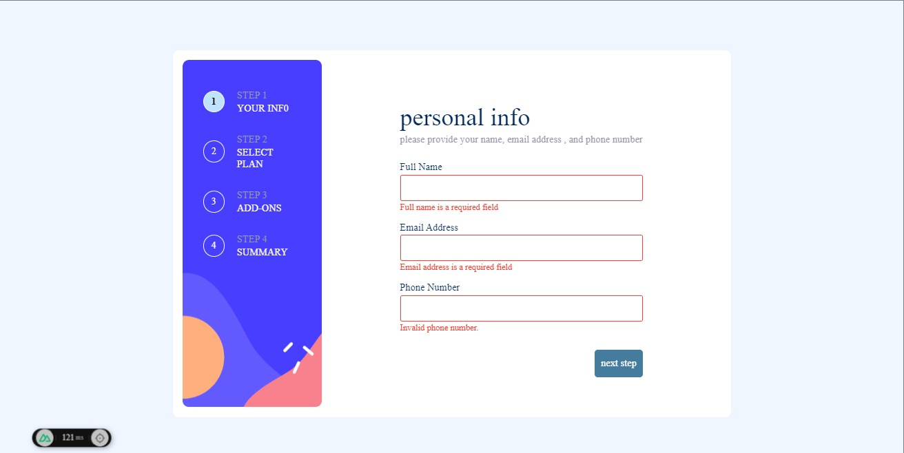

# Frontend Mentor - Multi-step form solution

This is a solution to the [Multi-step form challenge on Frontend Mentor](https://www.frontendmentor.io/challenges/multistep-form-YVAnSdqQBJ). Frontend Mentor challenges help you improve your coding skills by building realistic projects. 

## Table of contents

- [Overview](#overview)
  - [The challenge](#the-challenge)
  - [Screenshot](#screenshot)
  - [Links](#links)
- [My process](#my-process)
  - [Built with](#built-with)
  - [What I learned](#what-i-learned)
  - [Continued development](#continued-development)
  - [Useful resources](#useful-resources)
- [Author](#author)
- [Acknowledgments](#acknowledgments)

**Note: Delete this note and update the table of contents based on what sections you keep.**

## Overview

### The challenge

Users should be able to:

- Complete each step of the sequence
- Go back to a previous step to update their selections
- See a summary of their selections on the final step and confirm their order
- View the optimal layout for the interface depending on their device's screen size
- See hover and focus states for all interactive elements on the page
- Receive form validation messages if:
  - A field has been missed
  - The email address is not formatted correctly
  - A step is submitted, but no selection has been made

### Screenshot

### Links

- Solution URL: [Add solution URL here](https://github.com/seifelden66/multistep-form)
- Live Site URL: [Add live site URL here](https://effulgent-rugelach-6e2d19.netlify.app/)

## My process

### Built with

- pugjs
- SCSS 
- pinia
- typescript
- Mobile-first workflow
- [vue](https://vuejs.org/) - JS framework
- [nuxt.js](https://nuxt.com/) - vue framework
- [primevue Components](https://primevue.org/) - For styles

## Author

- Website - [Seif Elden](seif-elden.netlify.app)
- Frontend Mentor - [@seifelden66](https://www.frontendmentor.io/profile/seifelden66)

